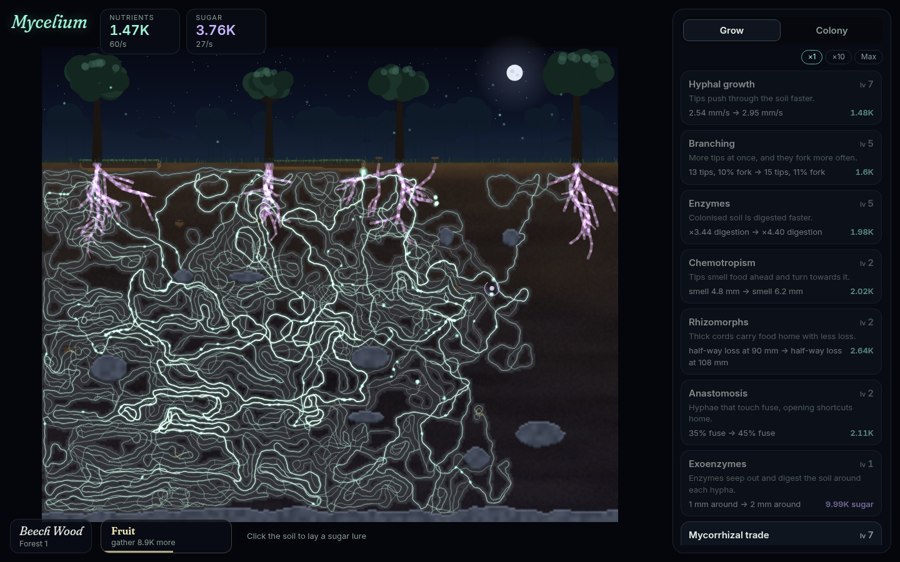
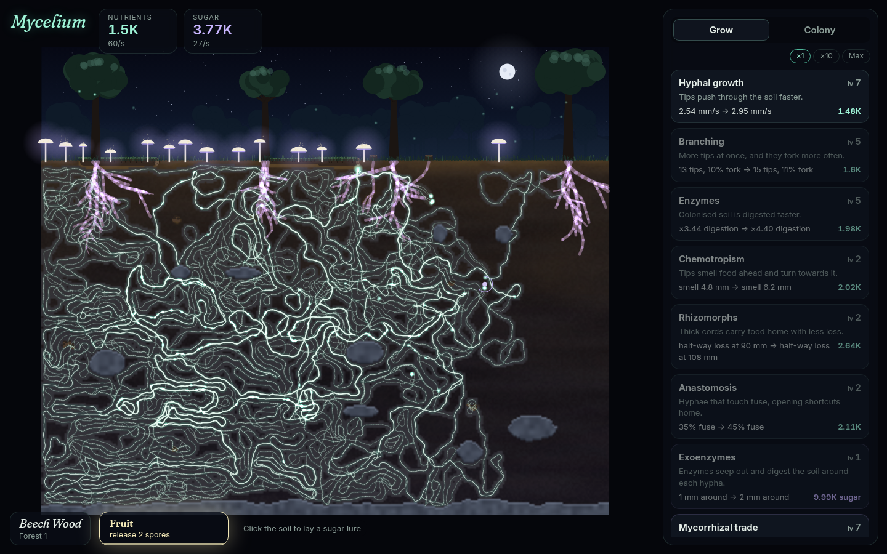

<h1 align="center">Mycelium</h1>

<p align="center">
  <b>An idle game about growing a fungal network under the forest floor.</b><br>
  A spore lands in the leaf litter. Its hyphae spread through the soil, digest what has fallen, carry the food
  home and trade with the trees above. When the ground is spent, it fruits, and the spores carry it to a new
  forest. Underneath is a real simulation: a Rust core compiled to WebAssembly, and a TypeScript game around it.
</p>

<p align="center">
  
</p>

**Live:** https://ardakalper.github.io/mycelium/

## The simulation (Rust → WebAssembly)

The colony isn't a number that goes up. It is grown tip by tip, following habits real fungi have:

- **Hyphal tips** push forward with a little random wandering, and branch behind the tip.
- **Chemotropism:** tips smell food ahead and turn towards it.
- **Negative autotropism:** tips turn away from their own crowded network, so the colony spreads out instead of
  clumping.
- **Anastomosis:** hyphae that meet fuse. The new loop gives food a shorter way home, and the shortest-path
  distances are repaired with Dijkstra from the fusion point.
- **Digestion** is saturating (Michaelis–Menten-like), cell by cell, over a 320×200 soil grid.
- **Growth costs food**, paid from what the tips digest locally. A colony in spent soil starves down to a crawl,
  so it can't grow forever and has to reach new food.
- **Transport loss:** food is worth `exp(−path length / transport)` by the time it gets home, so distance
  matters and thick cords (rhizomorphs) pay off.
- **Mycorrhizae:** hyphae that touch a living tree's roots form a link, and the tree pays sugar for it.
- **The soil** is generated per forest from a seed:
  - noise-based humus and a leaf-litter layer;
  - fallen logs, buried caches and dead roots;
  - boulders and bedrock;
  - living root systems.

  Every forest holds the same amount of food, spread differently.
- **Deterministic and exact to save.** A world is stored as its seed plus what changed (nutrients, the network,
  the tips). A loaded world continues bit-for-bit like the original, and a test checks that.

The module has **no dependencies and no wasm-bindgen**. It is a small C ABI (`world_new`, `world_step`,
`nodes_x`…). The page reads the network straight out of wasm memory through typed-array views, with zero
copies. It builds to about 67 KB.

## The game (TypeScript)

- **Upgrades:** nine of them change the simulation's parameters (growth, branching, enzymes, chemotropism,
  rhizomorphs, anastomosis, exoenzymes, mycorrhizal trade, saprotrophy). Some are paid in nutrients, some in
  tree sugar.
- **Fruiting** is the prestige reset. Mushrooms push up through the litter, spores drift to the next forest
  (Beech Wood, Pine Barrens, Cloud Forest, Birch Taiga), and every spore ever made adds 5% to all income.
- **Strains** are bought with spores and last through every forest: Vigorous, Hungry, Sweet-toothed, Dormant,
  Spore memory and Abundant.
- **Big numbers:** a hand-written mantissa/exponent class that keeps going far past 1e308. It also gives exact
  geometric cost series and a closed-form "how many levels can I afford", for ×10 and Max buying.
- **Time away:** the first five minutes are really simulated. After that, income is estimated at 40–100%
  depending on the Dormant strain, capped at 12 hours.
- **Lures and earthworms:** click the soil to lay a sugar lure that steers the tips. Click a passing earthworm
  for half a minute of income.
- **Rendering:** a painted night forest with procedural beeches, pines, oaks and birches, a moon, mist and
  fireflies. The soil shows strata, rocks, logs and roots, and goes pale where the colony has eaten it. The
  network is drawn incrementally as it grows, and redrawn every few seconds with each hypha's width set by how
  much of the colony drains through it. Light pulses travel home along the hyphae as food arrives.
- **Sound:** generative Web Audio, a breathing drone with cave-echo drips from a pentatonic scale as food
  arrives, a bell when a tree joins, and a bloom when you fruit.
- **Saves:** autosave every 15 seconds, deflated and base64-encoded. Saves can be copied and loaded as text.
  Works offline as a PWA.

<p align="center">
  
</p>

## Balance

`npm run balance` plays one forest in fast-forward against the real simulation with a greedy player that always
buys the cheapest upgrade. It prints how the run unfolds. Across eight seeds, the first fruiting comes after 8 to
31 minutes (median about 24). A player who uses lures gets there sooner. A unit test keeps it inside a window.

```
 10 min  run  8.99K  nodes  14145  eaten 45.2%  sugar 3.08K  grow7 bran5 enzy5 chem2 rhiz1 anas2 exoe1 symb7 sapr6
 20 min  run  34.7K  nodes  32983  eaten 79.5%  sugar 4.76K  grow9 bran7 enzy7 chem3 rhiz3 anas3 exoe2 symb9 sapr9
first fruiting possible after 14.7 min
```

## Run it locally

You need Rust with the `wasm32-unknown-unknown` target, and Node 22.6 or newer.

```sh
git clone https://github.com/ardakalper/mycelium
cd mycelium
rustup target add wasm32-unknown-unknown
npm install
npm start            # builds the wasm and the bundle, serves dist/ on http://localhost:4182
```

`?speed=10` fast-forwards time and `?fresh` ignores the save.

## Tests

```sh
npm run test:rust    # cargo: same seed same soil in every biome; growth stays inside the soil; food is conserved
                     # and distance costs yield; after fusions every distance is still a shortest path (checked
                     # against a fresh Dijkstra); roots pay sugar; lures pull; saves continue exactly; broken
                     # saves are refused
npm run test:unit    # node --test on the TypeScript itself (type stripping, no build): big-number arithmetic
                     # past 1e308, formatting, cost series against brute force; upgrades, bulk buying,
                     # fruiting, strains, time away, saves; the wasm through its TypeScript wrapper, including
                     # views that survive memory growth and a greedy run that must fruit in time
npm run test:e2e     # Playwright: intro and growth, buying, lures and earthworms, reload and time-away payout,
                     # fruiting into a new forest and buying strains, copy/load/reset, phone layout
```

CI runs `cargo test`, `clippy -D warnings`, `tsc`, the build, and both Node suites on every push. It deploys
`dist/` to GitHub Pages when `main` is green.

## How it is built

```
sim/src/world.rs     the simulation: soil generation, tips, branching, fusion + Dijkstra repair,
                     digestion, energy, transport, trees, binary save format
sim/src/ffi.rs       the C ABI the page calls (no wasm-bindgen)
sim/src/rng.rs       seeded xorshift and value noise
src/sim.ts           typed wrapper: loads the module, typed-array views into wasm memory
src/big.ts           big numbers, geometric cost series, affordable levels
src/economy.ts       upgrades, strains, multipliers, fruiting, time away, save format
src/render.ts        canvas renderer: painted forest and soil, incremental network, pulses, mushrooms
src/audio.ts         generative Web Audio ambience
src/main.ts          game loop, saving, time away, lures, earthworms, panels and dialogs
tools/build.mjs      cargo → wasm, esbuild → one ES module, public/ → dist/
tools/balance.ts     the greedy player
```

## License

MIT. Fonts: Fraunces and Inter, under the SIL Open Font License.
